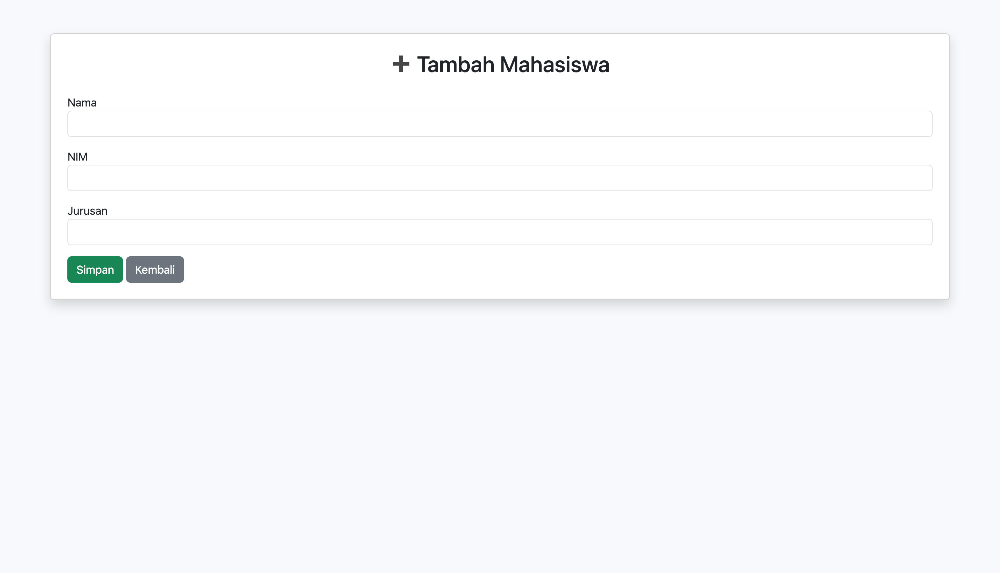
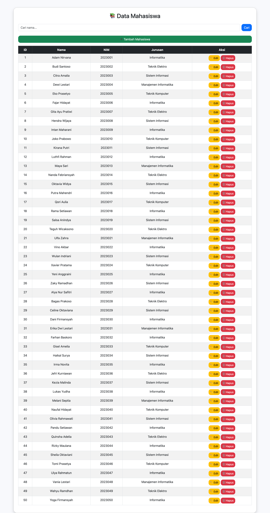
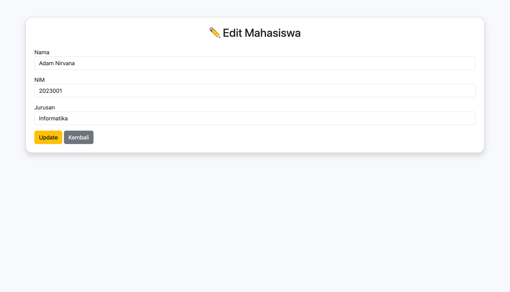
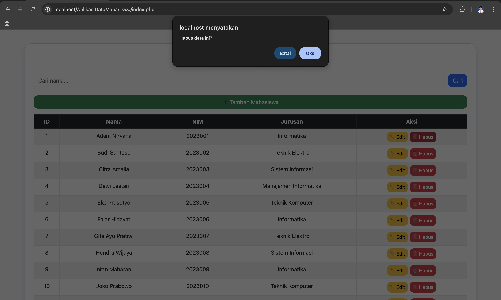
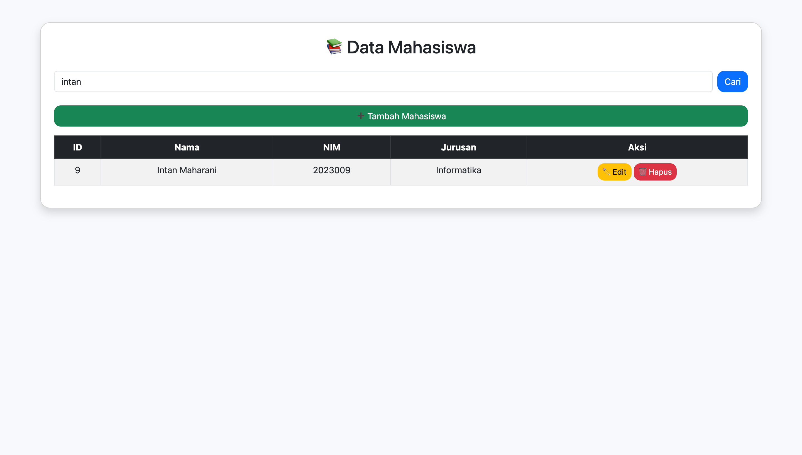

📚 Sistem CRUD Mahasiswa – PHP + MySQL
Sistem ini adalah aplikasi web sederhana untuk mengelola data mahasiswa menggunakan PHP Native, MySQL, dan Stored Procedure. Fitur yang tersedia meliputi Create, Read, Update, dan Delete (CRUD). Tampilan juga telah dilengkapi dengan styling dasar menggunakan Bootstrap.

🚀 Fitur Utama
✅ 1. Create (Tambah Mahasiswa)

Menggunakan stored procedure: tambah_mahasiswa

Input: nama, nim, jurusan

📄 2. Read (Tampilkan Semua Mahasiswa)

Menampilkan tabel data mahasiswa

Tombol aksi: Edit & Delete

✏️ 3. Update (Edit Mahasiswa)

menggunakan stored procedure: update_mahasiswa

🗑️ 4. Delete (Hapus Mahasiswa)

menggunakan stored procedure: hapus_mahasiswa

Konfirmasi melalui halaman delete.php (opsional)

🔎5. Find (Mencari Mahasiswa)

Menampilkan nama mahasiswa sesuai perintah yang diberikan di search bar

🗂️ Struktur Folder
/
├── index.php
├── tambah.php
├── edit.php
├── update.php
├── delete.php
├── config.php
├── README.md
└── /assets
     └── style.css (opsional)

🛠️ Teknologi yang Digunakan
| Komponen | Teknologi                          |
| -------- | ---------------------------------- |
| Bahasa   | PHP 8+                             |
| Database | MySQL / MariaDB                    |
| Server   | Apache (XAMPP, MAMP, Laragon, dsb) |
| UI       | Bootstrap 5                        |

Setup Database

1. Buat Database
'''CREATE DATABASE kampus;
USE kampus;'''

2. Buat Tabel Mahasiswa
CREATE TABLE mahasiswa (
    id INT AUTO_INCREMENT PRIMARY KEY,
    nama VARCHAR(100),
    nim VARCHAR(50),
    jurusan VARCHAR(100)
);

3. Stored Procedure
Insert
DELIMITER //
CREATE PROCEDURE tambah_mahasiswa(
    IN p_nama VARCHAR(100),
    IN p_nim VARCHAR(50),
    IN p_jurusan VARCHAR(100)
)
BEGIN
    INSERT INTO mahasiswa(nama, nim, jurusan)
    VALUES (p_nama, p_nim, p_jurusan);
END //
DELIMITER ;

Update
DELIMITER //
CREATE PROCEDURE update_mahasiswa(
    IN p_id INT,
    IN p_nama VARCHAR(100),
    IN p_nim VARCHAR(50),
    IN p_jurusan VARCHAR(100)
)
BEGIN
    UPDATE mahasiswa
    SET nama = p_nama, nim = p_nim, jurusan = p_jurusan
    WHERE id = p_id;
END //
DELIMITER ;

Delete
DELIMITER //
CREATE PROCEDURE hapus_mahasiswa(
    IN p_id INT
)
BEGIN
    DELETE FROM mahasiswa WHERE id = p_id;
END //
DELIMITER ;

⚙️ Konfigurasi Koneksi Database

config.php

<?php
$host = "localhost";
$user = "root";
$pass = "";
$db   = "kampus";

$conn = new mysqli($host, $user, $pass, $db);

if ($conn->connect_error) {
    die("Koneksi gagal: " . $conn->connect_error);
}
?>

▶️ Cara Menjalankan

1. Clone atau download repository
2. Pindahkan folder ke htdocs (XAMPP) atau www (Laragon)
3. Import database SQL
4. Jalankan server Apache
5. Akses aplikasi:
http://localhost/nama-folder/

🎨 Styling

Proyek ini menggunakan Bootstrap 5 CDN untuk tampilan yang bersih dan responsif.

Contoh penambahan pada <head>:

<link href="https://cdn.jsdelivr.net/npm/bootstrap@5.3.0/dist/css/bootstrap.min.css" rel="stylesheet">

🧪 Testing Fitur
| Fitur            | Status         |
| ---------------- | -------------- |
| Tambah Data      | ✔ Berfungsi    |
| Edit Data        | ✔ Berfungsi    |
| Hapus Data       | ✔ Berfungsi    |
| Read Data        | ✔ Berfungsi    |
| Stored Procedure | ✔ Terintegrasi |

